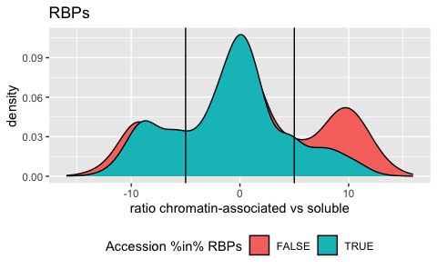
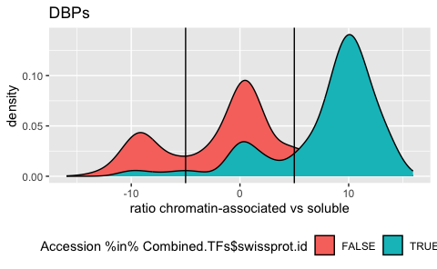
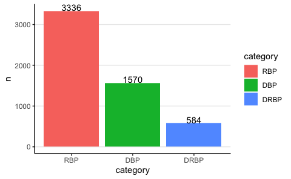
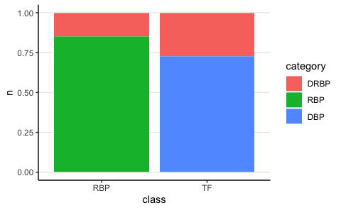
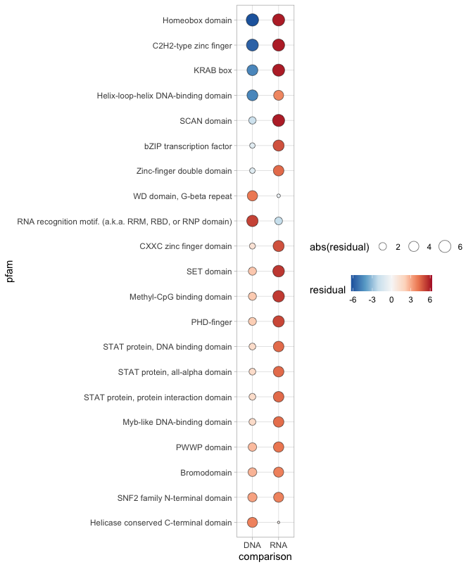
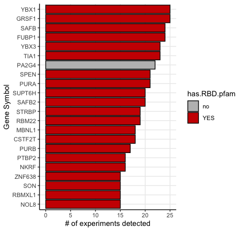
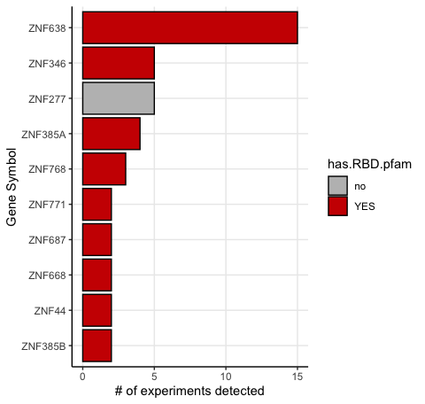
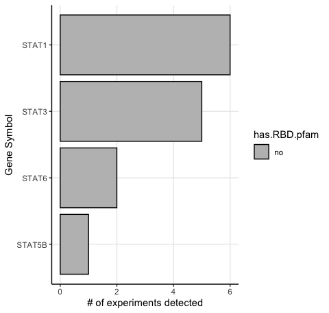

Examine enrichment of PFAM identifiers in DRBPs
================
Kaspar Bresser
18/12/2023

``` r
library(tidyverse)
```

In the following analyses we will generate a meta-dataset with DBPs,
RBPs, and DRBPs annotated. Then we’ll test whether certain domains are
enriched in the proteins annotated as DRBPs.

## RBPbase

To annotate RBPs we’ll use the RBPbase database
(<https://apps.embl.de/rbpbase/>).

Import the RBPbase database.

``` r
RBPbase.human <- read_tsv("Data/RBPbase_RBP_Database.tsv")

RBPbase.human
```

    ## # A tibble: 56,641 × 161
    ##    UNIQUE    ID        Description Hs_HEK293-RIC\nRBPBA…¹ Hs_HuH7-RIC\nRBPBASE…²
    ##    <chr>     <chr>     <chr>       <chr>                  <chr>                 
    ##  1 5_8S_rRNA ENSG0000… 5.8S ribos… no                     no                    
    ##  2 5S_rRNA   ENSG0000… 5S ribosom… no                     no                    
    ##  3 7SK       ENSG0000… 7SK RNA [S… no                     no                    
    ##  4 A1BG      ENSG0000… alpha-1-B … no                     no                    
    ##  5 A1BG-AS1  ENSG0000… A1BG antis… no                     no                    
    ##  6 A1CF      ENSG0000… APOBEC1 co… no                     YES                   
    ##  7 A2M       ENSG0000… alpha-2-ma… no                     no                    
    ##  8 A2M-AS1   ENSG0000… A2M antise… no                     no                    
    ##  9 A2ML1     ENSG0000… alpha-2-ma… no                     no                    
    ## 10 A2ML1-AS1 ENSG0000… A2ML1 anti… no                     no                    
    ## # ℹ 56,631 more rows
    ## # ℹ abbreviated names: ¹​`Hs_HEK293-RIC\nRBPBASE000000007.1`,
    ## #   ²​`Hs_HuH7-RIC\nRBPBASE000000008.1`
    ## # ℹ 156 more variables: `Hs_HeLa-RIC\nRBPBASE000000009.1` <chr>,
    ## #   `Hs_HeLa-RBDmap\nRBPBASE000000010.1` <chr>,
    ## #   `Hs_K562-serIC-chr\nRBPBASE000000011.1` <chr>,
    ## #   `Hs_K562-serIC\nRBPBASE000000012.1` <chr>, …

Tidy up a bit, many of the columns have impossible names, so rename
those. Select only this ones I need.

Also, convert the columns that contain the information on whether RBPs
were detected to a logical, so we can later sum up.

``` r
RBPbase.human  %>% 
  rename(swissprot.id = `UnitProtSwissProtID-Hs\nRBPANNO000000043.1`, TF.hs = `TF-Hs\nRBPANNO000000072.1`, 
         has.RBD.pfam = `hasRBD-Pfam-Hs\nRBPANNO000000017.1`, has.RBD.GO = `RNAbinding-GO-Hs\nRBPANNO000000038.1`, 
         pfam = `Pfam-Id-Hs\nRBPANNO000000046.1`, pfam.desc = `Pfam-Description-Hs\nRBPANNO000000048.1`) %>% 
  select(UNIQUE, swissprot.id, starts_with("Hs"), TF.hs, has.RBD.pfam, has.RBD.GO, pfam, pfam.desc) %>% 
  na.omit() %>% 
  mutate(across(starts_with("Hs"), ~case_when(. == "YES" ~ TRUE, TRUE ~ FALSE))) %>% 
  pivot_longer(cols = starts_with("Hs"), names_to = "Experiment", values_to = "Found") -> RBPbase.human

RBPbase.human
```

    ## # A tibble: 427,290 × 9
    ##    UNIQUE swissprot.id TF.hs has.RBD.pfam has.RBD.GO pfam   pfam.desc Experiment
    ##    <chr>  <chr>        <chr> <chr>        <chr>      <chr>  <chr>     <chr>     
    ##  1 A1BG   P04217       no    no           no         PF138… Immunogl… "Hs_HEK29…
    ##  2 A1BG   P04217       no    no           no         PF138… Immunogl… "Hs_HuH7-…
    ##  3 A1BG   P04217       no    no           no         PF138… Immunogl… "Hs_HeLa-…
    ##  4 A1BG   P04217       no    no           no         PF138… Immunogl… "Hs_HeLa-…
    ##  5 A1BG   P04217       no    no           no         PF138… Immunogl… "Hs_K562-…
    ##  6 A1BG   P04217       no    no           no         PF138… Immunogl… "Hs_K562-…
    ##  7 A1BG   P04217       no    no           no         PF138… Immunogl… "Hs_HeLa-…
    ##  8 A1BG   P04217       no    no           no         PF138… Immunogl… "Hs_HEK29…
    ##  9 A1BG   P04217       no    no           no         PF138… Immunogl… "Hs_micro…
    ## 10 A1BG   P04217       no    no           no         PF138… Immunogl… "Hs_JURKA…
    ## # ℹ 427,280 more rows
    ## # ℹ 1 more variable: Found <lgl>

Calculate for each swissprot entry in how many experiments it was found.

``` r
RBPbase.human %>% 
  group_by(swissprot.id) %>% 
  summarise(number.RBP.exps = sum(Found)) %>% 
  left_join(RBPbase.human, by = "swissprot.id") %>% 
  select(!c(Experiment, Found)) %>% 
  distinct(swissprot.id, .keep_all = T) -> evidence.RBPs

evidence.RBPs
```

    ## # A tibble: 14,150 × 8
    ##    swissprot.id number.RBP.exps UNIQUE  TF.hs has.RBD.pfam has.RBD.GO pfam      
    ##    <chr>                  <int> <chr>   <chr> <chr>        <chr>      <chr>     
    ##  1 A0A075B759                 0 PPIAL4E no    no           no         PF00160   
    ##  2 A0A087WTH5                 0 KCNE1B  no    no           no         PF02060   
    ##  3 A0A087WUL8                 0 NBPF19  no    no           no         PF06758|P…
    ##  4 A0A087WVF3                 0 TBC1D3D no    no           no         PF00566   
    ##  5 A0A087WXS9                 0 TBC1D3I no    no           no         PF00566   
    ##  6 A0A087X179                 0 TBC1D3E no    no           no         PF00566   
    ##  7 A0A087X1C5                 0 CYP2D7  no    no           no         PF00067   
    ##  8 A0A087X1G2                 0 TBC1D3K no    no           no         PF00566   
    ##  9 A0A096LP55                 0 UQCRHL  no    no           no         PF02320   
    ## 10 A0A0B4J2A2                 0 PPIAL4C no    no           no         PF00160   
    ## # ℹ 14,140 more rows
    ## # ℹ 1 more variable: pfam.desc <chr>

## HOCOMOCO & JASPAR

To annotate DBPs, we’ll use the transcription factor databases JASPAR
and MOCOMOCO.

Import the HOCOMOCO database.

``` r
HM.TFs <- read_tsv("Data/HOCOMOCO_TF_Database.tsv")

HM.TFs
```

    ## # A tibble: 772 × 13
    ##    Model       LOGO  `Transcription factor` `Model length` Quality `Data source`
    ##    <chr>       <lgl> <chr>                           <dbl> <chr>   <chr>        
    ##  1 AHR_HUMAN.… NA    HUMAN:AHR                           9 B       Integrative  
    ##  2 AIRE_HUMAN… NA    HUMAN:AIRE                         18 C       Integrative  
    ##  3 ALX1_HUMAN… NA    HUMAN:ALX1                         12 B       Integrative  
    ##  4 ALX3_HUMAN… NA    HUMAN:ALX3                         11 D       HT-SELEX     
    ##  5 ALX4_HUMAN… NA    HUMAN:ALX4                         12 D       HT-SELEX     
    ##  6 ANDR_HUMAN… NA    HUMAN:AR                           18 A       ChIP-Seq     
    ##  7 ANDR_HUMAN… NA    HUMAN:AR                           16 A       ChIP-Seq     
    ##  8 ANDR_HUMAN… NA    HUMAN:AR                           12 A       ChIP-Seq     
    ##  9 AP2A_HUMAN… NA    HUMAN:TFAP2A                       15 A       ChIP-Seq     
    ## 10 AP2B_HUMAN… NA    HUMAN:TFAP2B                       10 B       Integrative  
    ## # ℹ 762 more rows
    ## # ℹ 7 more variables: `Best auROC (human)` <dbl>, `TF family` <chr>,
    ## #   `TF subfamily` <chr>, HGNC <chr>, EntrezGene <chr>, `UniProt ID` <chr>,
    ## #   `UniProt AC` <chr>

Tidy up a bit

``` r
HM.TFs %>% 
  select(`Transcription factor`, `TF family`, `UniProt AC`, `UniProt ID`, `Best auROC (human)` ) %>% 
  rename(swissprot.id = `UniProt AC` ) %>% 
  distinct(swissprot.id, .keep_all = T) -> HM.TFs

HM.TFs
```

    ## # A tibble: 680 × 5
    ##    `Transcription factor` `TF family`                  swissprot.id `UniProt ID`
    ##    <chr>                  <chr>                        <chr>        <chr>       
    ##  1 HUMAN:AHR              PAS domain factors{1.2.5}    P35869       AHR_HUMAN   
    ##  2 HUMAN:AIRE             AIRE{5.3.1}                  O43918       AIRE_HUMAN  
    ##  3 HUMAN:ALX1             Paired-related HD factors{3… Q15699       ALX1_HUMAN  
    ##  4 HUMAN:ALX3             Paired-related HD factors{3… O95076       ALX3_HUMAN  
    ##  5 HUMAN:ALX4             Paired-related HD factors{3… Q9H161       ALX4_HUMAN  
    ##  6 HUMAN:AR               Steroid hormone receptors (… P10275       ANDR_HUMAN  
    ##  7 HUMAN:TFAP2A           AP-2{1.3.1}                  P05549       AP2A_HUMAN  
    ##  8 HUMAN:TFAP2B           AP-2{1.3.1}                  Q92481       AP2B_HUMAN  
    ##  9 HUMAN:TFAP2C           AP-2{1.3.1}                  Q92754       AP2C_HUMAN  
    ## 10 HUMAN:TFAP2D           AP-2{1.3.1}                  Q7Z6R9       AP2D_HUMAN  
    ## # ℹ 670 more rows
    ## # ℹ 1 more variable: `Best auROC (human)` <dbl>

Import the JASPAR database, this comes in a bit of a annoying format,
but each entry does seem to contain a line that contains the uniprot ID.
Parse out that information.

``` r
Jaspar.TFs <- read_lines("Data/Jaspar_TF_Database2.txt")

Jaspar.TFs %>% 
  map_chr(str_extract, "uniprot_ids.+") %>% 
  na.omit() %>% 
  str_remove("uniprot_ids:") %>% 
  str_split("; " ) %>% 
  unlist() -> Jaspar.Uniprot

str(Jaspar.Uniprot)
```

    ##  chr [1:955] "P53762" "P26367" "P35398" "P11473" "P19793" "Q04864" "Q04206" ...

Import swissprot (Human, downloaded 14-12-2023)

``` r
SP.database <- read_tsv("Data/Swissprot_2023_12_14.tsv.gz")
```

Next, add those TFs to the HOCOMOCO database.

``` r
tibble(swissprot.id = Jaspar.Uniprot) %>% 
  semi_join(SP.database, by = c("swissprot.id" = "Entry")) %>% 
  full_join(HM.TFs, by = "swissprot.id") %>% 
  replace_na(list(`TF family` = "Jaspar")) -> Combined.TFs

Combined.TFs
```

    ## # A tibble: 949 × 5
    ##    swissprot.id `Transcription factor` `TF family`                  `UniProt ID`
    ##    <chr>        <chr>                  <chr>                        <chr>       
    ##  1 P26367       HUMAN:PAX6             Paired plus homeo domain{3.… PAX6_HUMAN  
    ##  2 P35398       HUMAN:RORA             Thyroid hormone receptor-re… RORA_HUMAN  
    ##  3 P11473       HUMAN:VDR              Thyroid hormone receptor-re… VDR_HUMAN   
    ##  4 P19793       HUMAN:RXRA             RXR-related receptors (NR2)… RXRA_HUMAN  
    ##  5 Q04864       HUMAN:REL              NF-kappaB-related factors{6… REL_HUMAN   
    ##  6 Q04206       HUMAN:RELA             NF-kappaB-related factors{6… TF65_HUMAN  
    ##  7 P19793       HUMAN:RXRA             RXR-related receptors (NR2)… RXRA_HUMAN  
    ##  8 P55055       HUMAN:NR1H2            Thyroid hormone receptor-re… NR1H2_HUMAN 
    ##  9 P08651       HUMAN:NFIC             Nuclear factor 1{7.1.2}      NFIC_HUMAN  
    ## 10 P31314       HUMAN:TLX1             NK-related factors{3.1.2}    TLX1_HUMAN  
    ## # ℹ 939 more rows
    ## # ℹ 1 more variable: `Best auROC (human)` <dbl>

``` r
write_tsv(Combined.TFs, "Data/TFs_HOCOMOCO_Jaspar.tsv")
```

Now to annotate. Any protein detected at least once in RBPbase is
annotated as a RBP, any TF from JASPAR or HOCOMOCO is a DBP, the overlap
is defines as a DRBP.

``` r
evidence.RBPs %>% 
  left_join(Combined.TFs, by = "swissprot.id") %>% 
  ungroup() %>% 
  distinct(swissprot.id, .keep_all = T) %>% 
  mutate(is.TF = !is.na(`TF family`) | TF.hs == "YES") %>% 
  mutate(has.RBD = has.RBD.pfam == "YES" | has.RBD.GO == "YES") %>% 
  mutate(category = case_when(number.RBP.exps > 0 & is.TF == TRUE ~ "DRBP",
                              number.RBP.exps < 1 & is.TF == TRUE ~ "DBP",
                              number.RBP.exps > 0 & is.TF == FALSE ~ "RBP",
                              TRUE ~ "other")) -> categorised.dat
```

## Import chromatin association studies

To expand the DRBP set beyond transcription factors, will make use of
data from the study by Ren et al (PMID: 34649616, PMCID: PMC8518180).

Read in the MS data, from 3 cell lines.

``` r
dat <- tibble(cell.line = c("293T", "THP1", "K562"), MS = list(read_tsv("Data/Ren_MS_293T_Data.tsv"),
                                                            read_tsv("Data/Ren_MS_THP1_Data.tsv"),
                                                            read_tsv("Data/Ren_MS_K562_Data.tsv") ))

dat
```

    ## # A tibble: 3 × 2
    ##   cell.line MS                     
    ##   <chr>     <list>                 
    ## 1 293T      <spc_tbl_ [2,434 × 34]>
    ## 2 THP1      <spc_tbl_ [4,849 × 25]>
    ## 3 K562      <spc_tbl_ [2,459 × 34]>

Write function to tidy and calculate ratios

The authors performed MS on the chromatin associated and the soluble
fraction of the nucleus. Calculate the average of the replicates, and
calculate the ratio.

``` r
format_MS_data <- function(df){
  
  df %>% 
    mutate(Area.CPE = (Area.rep1.CPE+Area.rep2.CPE)/2,
           Area.SNE = (Area.rep1.SNE+Area.rep2.SNE)/2,
           ratio.area = log2((Area.CPE+10000)/(Area.SNE+10000)),
           fraq.area = Area.CPE/(Area.CPE+Area.SNE)) %>% 
    select(Accession, Area.CPE, Area.SNE, ratio.area, fraq.area)
  
}
```

Apply the functiona and get the average of the ratio’s across the cell
types

``` r
dat %>% 
  mutate(MS = map(MS, format_MS_data)) %>% 
  unnest(MS) %>% 
  group_by(Accession) %>% 
  summarise(ratio.area = mean(ratio.area)) -> ratios.averages

ratios.averages
```

    ## # A tibble: 5,676 × 2
    ##    Accession  ratio.area
    ##    <chr>           <dbl>
    ##  1 A0A024QZP7      0.662
    ##  2 A0A024R7P0     11.2  
    ##  3 A0A024R7W5     -3.41 
    ##  4 A0A067XG54      1.21 
    ##  5 A0A075B6P0      0    
    ##  6 A0A075B738      1.05 
    ##  7 A0A075B784     11.2  
    ##  8 A0A075B7F8      3.22 
    ##  9 A0A087WSW7     12.4  
    ## 10 A0A087WSY5      0    
    ## # ℹ 5,666 more rows

Define RBPs by any proteins that were found in at least 1 experiment

``` r
RBPs <- filter(evidence.RBPs, number.RBP.exps > 1) %>% pull(swissprot.id)
```

Plot ratio’s of RBPs, note that indeed the RBPs are skewed more toward
the soluble fraction

``` r
ggplot(ratios.averages, aes(x =  ratio.area, fill = Accession %in% RBPs))+
  geom_density()+
  theme(legend.position = "bottom")+
  labs(x = "ratio chromatin-associated vs soluble", title = "RBPs")+
  geom_vline(xintercept = c(5, -5))
```



Same for DBPs, note that they are heavily skewed toward chromatin
fraction

``` r
ggplot(ratios.averages, aes(x =  ratio.area, fill = Accession %in% Combined.TFs$swissprot.id))+
  geom_density()+
  theme(legend.position = "bottom")+
  labs(x = "ratio chromatin-associated vs soluble", title = "DBPs")+
  geom_vline(xintercept = c(5, -5))
```



Based on this, decided to extend the list of DBPs with all proteins that
have a ratio of \>5.

``` r
categorised.dat %>% 
  select(swissprot.id, UNIQUE, pfam.desc, category, number.RBP.exps) %>% 
  left_join(ratios.averages, by = c("swissprot.id" = "Accession")) %>% 
  mutate(category = case_when(category == "RBP" & ratio.area > 5 ~ "DRBP",
                              category == "other" & ratio.area > 5 ~ "DBP",
                              TRUE ~ category)) %>% 
    filter(category != "other") -> categorised.dat
```

Plot the number of proteins in each category

``` r
categorised.dat %>% 
  count(category) %>% 
  mutate(category = factor(category, levels = c("RBP", "DBP", "DRBP"))) %>% 
  ggplot(aes(x = category, y = n, fill = category))+
  geom_bar(stat = "identity", position = "dodge")+
  geom_text(stat='identity', aes(label=n), vjust = 0)+
  theme_classic()+
  theme(panel.grid.major.y = element_line())
```



``` r
ggsave("Figs/group_sizes_extended.pdf", width = 3, height = 2, scale = 1.5)
```

And plot the % of DRBPs within both DBPs and RBPs

``` r
categorised.dat %>% 
  mutate(TF = case_when(category != "RBP" ~ "TF",
                   TRUE ~ "other"),
         RBP = case_when(number.RBP.exps > 0 ~ "RBP",
                         TRUE ~ "other")) %>% 
  pivot_longer(c(TF, RBP), names_to = "columns", values_to = "class") %>% 
  mutate(category = factor(category, levels = c("DRBP", "RBP", "DBP"))) %>% 
  filter(class != "other") -> plot.dat

plot.dat
```

    ## # A tibble: 6,074 × 8
    ##    swissprot.id UNIQUE   pfam.desc   category number.RBP.exps ratio.area columns
    ##    <chr>        <chr>    <chr>       <fct>              <int>      <dbl> <chr>  
    ##  1 A0AV96       RBM47    RNA recogn… RBP                   18      NA    RBP    
    ##  2 A0AVK6       E2F8     E2F/DP fam… DBP                    0      NA    TF     
    ##  3 A0AVT1       UBA6     Ubiquitin-… RBP                    5      NA    RBP    
    ##  4 A0FGR8       ESYT2    Synaptotag… DRBP                   4       8.33 TF     
    ##  5 A0FGR8       ESYT2    Synaptotag… DRBP                   4       8.33 RBP    
    ##  6 A0PJY2       FEZF1    C2H2-type … DBP                    0      NA    TF     
    ##  7 A1L020       MEX3A    Zinc finge… RBP                    7      NA    RBP    
    ##  8 A1L390       PLEKHG3  RhoGEF dom… RBP                    1      NA    RBP    
    ##  9 A1X283       SH3PXD2B SH3 domain… RBP                    1      -8.74 RBP    
    ## 10 A1YPR0       ZBTB7C   BTB/POZ do… DBP                    0      NA    TF     
    ## # ℹ 6,064 more rows
    ## # ℹ 1 more variable: class <chr>

``` r
ggplot(plot.dat %>% count(category, class), aes(x = class, y = n, fill = category))+
  geom_bar(stat = "identity", position = "fill")+
  theme_classic()+
  theme(panel.grid.major.y = element_line())
```



``` r
ggsave("Figs/group_fractions_extended.pdf", width = 2, height = 2, scale = 1.5)
```

Extract the percentages

``` r
plot.dat %>% 
  count(category, class)
```

    ## # A tibble: 4 × 3
    ##   category class     n
    ##   <fct>    <chr> <int>
    ## 1 DRBP     RBP     584
    ## 2 DRBP     TF      584
    ## 3 RBP      RBP    3336
    ## 4 DBP      TF     1570

``` r
(584/(3336+584))*100
```

    ## [1] 14.89796

``` r
(584/(1570+584))*100
```

    ## [1] 27.11235

Export supplementary table

``` r
categorised.dat %>% 
  mutate(Source.Jaspar = case_when(swissprot.id %in% Jaspar.Uniprot ~ "Jaspar",
                                TRUE ~ NA),
         Source.HOCOMOCO = case_when(swissprot.id %in% HM.TFs$swissprot.id ~ "HOCOMOCO",
                                TRUE ~ NA),
         Source.Ren = case_when(ratio.area > 5 ~ "Ren et al",
                                TRUE ~ NA)) %>% 
  unite(col = "Source.DBP", Source.Jaspar, Source.HOCOMOCO, Source.Ren, sep = " | ", na.rm = T) %>% 
  transmute(swissprot.id = swissprot.id, gene.symbol = UNIQUE, annotation = category, number.RBP.exps = number.RBP.exps, Source.DBP = Source.DBP) %>% 
  arrange(desc(number.RBP.exps)) -> supp.table.1

write_tsv(supp.table.1, "Data/Supplementary_Table_1.tsv")
```

## Perform Chi Square test

Now will test for enrichment of pfam ids by performing Chi Square tests.

First, there are multiple identifiers representing C2H2-type zinc finger
domains, consolidate those.

``` r
categorised.dat %>% 
  separate_longer_delim(pfam.desc, "|") %>% 
  mutate(pfam.desc = case_when(str_detect(pfam.desc, "C2H2") ~ "C2H2-type zinc finger",
                               TRUE ~ pfam.desc)) -> combined.table

combined.table
```

    ## # A tibble: 9,480 × 6
    ##    swissprot.id UNIQUE pfam.desc             category number.RBP.exps ratio.area
    ##    <chr>        <chr>  <chr>                 <chr>              <int>      <dbl>
    ##  1 A0AV96       RBM47  RNA recognition moti… RBP                   18      NA   
    ##  2 A0AVK6       E2F8   E2F/DP family winged… DBP                    0      NA   
    ##  3 A0AVT1       UBA6   Ubiquitin-activating… RBP                    5      NA   
    ##  4 A0AVT1       UBA6   Ubiquitin-activating… RBP                    5      NA   
    ##  5 A0AVT1       UBA6   Ubiquitin-activating… RBP                    5      NA   
    ##  6 A0AVT1       UBA6   ThiF family           RBP                    5      NA   
    ##  7 A0AVT1       UBA6   Ubiquitin fold domain RBP                    5      NA   
    ##  8 A0FGR8       ESYT2  Synaptotagmin-like m… DRBP                   4       8.33
    ##  9 A0FGR8       ESYT2  C2 domain             DRBP                   4       8.33
    ## 10 A0PJY2       FEZF1  C2H2-type zinc finger DBP                    0      NA   
    ## # ℹ 9,470 more rows

Write several wrapper functions around chisq.test. These functions
prepare the dataframe to test for a single pfam, and output a single row
that contains: observed, expected, residual and p.value.

in short the function: (1) check if the proteins contain the pfam. (2)
count within each annotation how many of that pfam is found. (3) select
the annotations to be compared. (4) Perform the chi square test. (4)
Extract the results into a dataframe row.

``` r
do_chisq_total <- function(pf){
  combined.table %>% 
    mutate(contains.pfam = pfam.desc == pf) %>%
    group_by(swissprot.id, category) %>% 
    summarise(contains.pfam = sum(contains.pfam) > 0) %>% 
    ungroup() %>% 
    mutate(contains.pfam = factor(contains.pfam, levels = c("TRUE", "FALSE")))  %>% 
    count(category, contains.pfam, .drop = F) %>% 
    pivot_wider(names_from = category, values_from = n) %>% 
    mutate(nonBRBP = RBP + DBP) %>% 
    select(!c(DBP, RBP)) %>% 
#    select(contains.pfam, DBP, DRBP) %>% 
    column_to_rownames("contains.pfam") %>% 
    as.matrix() %>% 
    chisq.test() -> test.res
  

   observed <- test.res$observed["TRUE", "DRBP"]
   expected <- test.res$expected["TRUE", "DRBP"]
   residual <- test.res$residuals["TRUE", "DRBP"]
   
   p.val <- test.res$p.value
  
   tibble(pfam = pf, observed.all = observed, expected.all = expected, residual.all = residual, p.val.all = p.val)
}

do_chisq_rna <- function(pf){
  combined.table %>% 
    mutate(contains.pfam = pfam.desc == pf) %>%
    group_by(swissprot.id, category) %>% 
    summarise(contains.pfam = sum(contains.pfam) > 0) %>% 
    ungroup() %>% 
    mutate(contains.pfam = factor(contains.pfam, levels = c("TRUE", "FALSE")))  %>% 
    count(category, contains.pfam, .drop = F) %>% 
    pivot_wider(names_from = category, values_from = n) %>% 
    mutate(nonBRBP = RBP + DBP) %>% 
    select(contains.pfam, RBP, DRBP) %>% 
    column_to_rownames("contains.pfam") %>% 
    as.matrix() %>% 
    chisq.test() -> test.res
  
  
   observed <- test.res$observed["TRUE", "DRBP"]
   expected <- test.res$expected["TRUE", "DRBP"]
   residual <- test.res$residuals["TRUE", "DRBP"]
   
   p.val <- test.res$p.value
  
   tibble(pfam = pf, observed.rna = observed, expected.rna = expected, residual.rna = residual, p.val.rna = p.val)
}

do_chisq_dna <- function(pf){
  combined.table %>% 
    mutate(contains.pfam = pfam.desc == pf) %>%
    group_by(swissprot.id, category) %>% 
    summarise(contains.pfam = sum(contains.pfam) > 0) %>% 
    ungroup() %>% 
    mutate(contains.pfam = factor(contains.pfam, levels = c("TRUE", "FALSE")))  %>% 
    count(category, contains.pfam, .drop = F) %>% 
    pivot_wider(names_from = category, values_from = n) %>% 
    mutate(nonBRBP = RBP + DBP) %>% 
    select(contains.pfam, DBP, DRBP) %>% 
    column_to_rownames("contains.pfam") %>% 
    as.matrix() %>% 
    chisq.test() -> test.res
  
   observed <- test.res$observed["TRUE", "DRBP"]
   expected <- test.res$expected["TRUE", "DRBP"]
   residual <- test.res$residuals["TRUE", "DRBP"]
   
   p.val <- test.res$p.value
  
   tibble(pfam = pf, observed.dna = observed, expected.dna = expected, residual.dna = residual, p.val.dna = p.val)
}
```

Perform the chisquare test on all pfams in the dataset. Compare DRBPs to
either DBPs, RBPs or both.

``` r
combined.table %>% 
  pull(pfam.desc) %>% 
  unique() -> all.pfams

results.chi.dna <- map_dfr(as.list(all.pfams), do_chisq_dna)
results.chi.rna <- map_dfr(as.list(all.pfams), do_chisq_rna)
results.chi.all <- map_dfr(as.list(all.pfams), do_chisq_total)
```

Combine the results, and output

``` r
list(results.chi.dna, results.chi.rna, results.chi.all) %>% 
  reduce(full_join, by = "pfam") -> combined.results

write_tsv(combined.results, "Output/chi_results_DRBP_extended.tsv")

combined.results
```

    ## # A tibble: 2,385 × 13
    ##    pfam           observed.dna expected.dna residual.dna  p.val.dna observed.rna
    ##    <chr>                 <int>        <dbl>        <dbl>      <dbl>        <int>
    ##  1 RNA recogniti…           14        3.80          5.24   4.82e- 9           14
    ##  2 E2F/DP family…            0        2.98         -1.73   9.14e- 2            0
    ##  3 Ubiquitin-act…            0        0           NaN    NaN                   0
    ##  4 Ubiquitin-act…            0        0           NaN    NaN                   0
    ##  5 Ubiquitin-act…            0        0           NaN    NaN                   0
    ##  6 ThiF family               0        0           NaN    NaN                   0
    ##  7 Ubiquitin fol…            0        0           NaN    NaN                   0
    ##  8 Synaptotagmin…            1        0.271         1.40   6.07e- 1            1
    ##  9 C2 domain                 2        0.542         1.98   1.27e- 1            2
    ## 10 C2H2-type zin…           93      168.           -5.76   2.10e-15           93
    ## # ℹ 2,375 more rows
    ## # ℹ 7 more variables: expected.rna <dbl>, residual.rna <dbl>, p.val.rna <dbl>,
    ## #   observed.all <int>, expected.all <dbl>, residual.all <dbl>, p.val.all <dbl>

``` r
combined.results <- read_tsv("Output/chi_results_DRBP_extended.tsv")
```

Grab the columns needed for plotting

``` r
combined.results %>% 
  transmute( pfam = pfam, residual = residual.rna, p.val = p.val.rna, comparison = "RNA") -> tmp

combined.results %>% 
  transmute(pfam = pfam, residual = residual.dna, p.val = p.val.dna, comparison = "DNA") %>% 
  bind_rows(tmp) -> combined.results

combined.results
```

    ## # A tibble: 4,770 × 4
    ##    pfam                                            residual     p.val comparison
    ##    <chr>                                              <dbl>     <dbl> <chr>     
    ##  1 RNA recognition motif. (a.k.a. RRM, RBD, or RN…     5.24  4.82e- 9 DNA       
    ##  2 E2F/DP family winged-helix DNA-binding domain      -1.73  9.14e- 2 DNA       
    ##  3 Ubiquitin-activating enzyme E1 FCCH domain         NA    NA        DNA       
    ##  4 Ubiquitin-activating enzyme E1 four-helix bund…    NA    NA        DNA       
    ##  5 Ubiquitin-activating enzyme active site            NA    NA        DNA       
    ##  6 ThiF family                                        NA    NA        DNA       
    ##  7 Ubiquitin fold domain                              NA    NA        DNA       
    ##  8 Synaptotagmin-like mitochondrial-lipid-binding…     1.40  6.07e- 1 DNA       
    ##  9 C2 domain                                           1.98  1.27e- 1 DNA       
    ## 10 C2H2-type zinc finger                              -5.76  2.10e-15 DNA       
    ## # ℹ 4,760 more rows

Filter for highly significant

``` r
combined.results %>% 
  group_by(pfam) %>% 
  filter(any(p.val < 0.0001)) %>% 
  ungroup() %>% 
  mutate(residual = case_when(residual > 6 ~ 6,
                                  TRUE ~ residual)) -> for.plot


for.plot
```

    ## # A tibble: 42 × 4
    ##    pfam                                             residual    p.val comparison
    ##    <chr>                                               <dbl>    <dbl> <chr>     
    ##  1 RNA recognition motif. (a.k.a. RRM, RBD, or RNP…    5.24  4.82e- 9 DNA       
    ##  2 C2H2-type zinc finger                              -5.76  2.10e-15 DNA       
    ##  3 KRAB box                                           -4.67  3.23e- 9 DNA       
    ##  4 Homeobox domain                                    -6.29  1.76e-14 DNA       
    ##  5 WD domain, G-beta repeat                            4.13  4.44e- 6 DNA       
    ##  6 Helix-loop-helix DNA-binding domain                -4.69  3.54e- 8 DNA       
    ##  7 SCAN domain                                        -1.84  4.18e- 2 DNA       
    ##  8 Zinc-finger double domain                          -0.983 3.54e- 1 DNA       
    ##  9 Helicase conserved C-terminal domain                3.91  1.54e- 5 DNA       
    ## 10 SNF2 family N-terminal domain                       3.18  5.80e- 4 DNA       
    ## # ℹ 32 more rows

Get a nice order for the plots

``` r
for.plot %>% 
  pivot_wider(names_from = comparison, values_from = c(p.val, residual)) %>% 
  mutate(type = case_when(residual_DNA > 0 & residual_RNA < 0 ~ "RNA.skewed",
                          residual_DNA < 0 & residual_RNA > 0 ~ "DNA.skewed",
                          TRUE ~ "rest"),
         diff = residual_DNA - residual_RNA) %>% 
  arrange(type, diff) %>% 
  pull(pfam) -> pfam.order

for.plot <- mutate(for.plot, pfam = factor(pfam, levels = rev(pfam.order)))
```

``` r
limit <- max(abs(for.plot$residual)) * c(-1, 1)

ggplot(for.plot, aes(x = pfam, y = comparison, size = abs(residual), fill = residual))+
  geom_point(color = "black", shape = 21, stroke = .25)+
  scale_fill_distiller(palette = "RdBu", limit = limit)+
  coord_flip()+
  theme_light()+
  theme(legend.box = "vertical", legend.position = "right", legend.direction = "horizontal")
```



``` r
ggsave("Figs/PFAMs_enrichments.pdf", width = 8.5, height = 6, scale = .8)
```

## Barcharts

### Top RBPs

``` r
evidence.RBPs %>% 
  left_join(Combined.TFs, by = "swissprot.id") %>% 
  filter(!is.na(`TF family`) | TF.hs == "YES") %>% 
  distinct(swissprot.id, .keep_all = T) -> TF.RBP.intersect

evidence.RBPs %>% 
  select(UNIQUE, has.RBD.pfam) %>% 
  inner_join(categorised.dat) %>% 
  filter(category == "DRBP") -> to.plot


to.plot %>% 
  ungroup() %>% 
  slice_max(order_by = number.RBP.exps, n = 20) %>% 
ggplot(aes(x = fct_reorder(UNIQUE, number.RBP.exps), y = number.RBP.exps, fill = has.RBD.pfam))+
  geom_bar(stat = "identity", color = "black")+
  coord_flip()+
  scale_fill_manual(values = c("grey", "red3"))+
  theme_classic()+
  theme(panel.grid.major = element_line())+
  labs(x = "Gene Symbol", y = "# of experiments detected")
```



``` r
ggsave("Figs/TF_RBP_TOPnew.pdf", width = 3, height = 4, scale = 1.2)
```

### ZFN family

``` r
to.plot %>% 
  ungroup() %>% 
  filter(str_detect(UNIQUE, "ZFP|ZNF")) %>% 
  filter(number.RBP.exps > 1) %>% 
#  slice_max(order_by = number.RBP.exps, n = 12) %>% 
ggplot(aes(x = fct_reorder(UNIQUE, number.RBP.exps), y = number.RBP.exps, fill = has.RBD.pfam))+
  geom_bar(stat = "identity", color = "black")+
  coord_flip()+
  scale_fill_manual(values = c("grey", "red3"))+
  theme_classic()+
  theme(panel.grid.major = element_line())+
  labs(x = "Gene Symbol", y = "# of experiments detected")
```



``` r
ggsave("Figs/TF_RBP_ZNFs.pdf", width = 3, height = 3, scale = 1.2)
```

### STATs

``` r
to.plot %>% 
  ungroup() %>% 
  filter(str_detect(UNIQUE, "STAT")) %>% 
ggplot(aes(x = fct_reorder(UNIQUE, number.RBP.exps), y = number.RBP.exps, fill = has.RBD.pfam))+
  geom_bar(stat = "identity", color = "black")+
  coord_flip()+
  scale_fill_manual(values = c("grey", "red3"))+
  theme_classic()+
  theme(panel.grid.major = element_line())+
  labs(x = "Gene Symbol", y = "# of experiments detected")
```



``` r
ggsave("Figs/TF_RBP_STATs.pdf", width = 3, height = 3, scale = 1.2)
```
